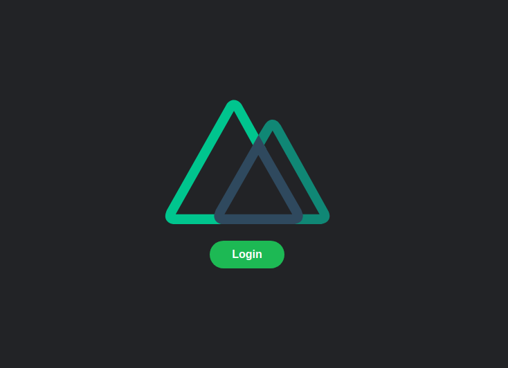
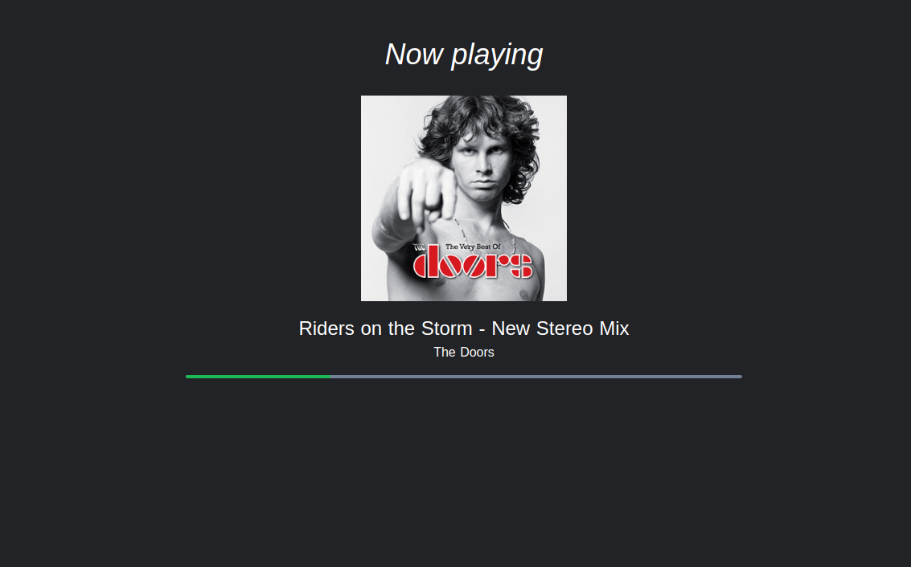

# songstatsApp

The idea of this project is that you could login with Spotify and then see cool stuff about the current playing song, like interesting facts, release year, popularity and more!

Right now at this moment I had to stop developing because couldn't find an appropiate API to work with this data, Songfacts API is not free and it's not even open to general public. I'll continue this project when something is available.

This APP is just the backend, built with Lumen, for the frontend check my other [repository built with Nuxt and Tailwind](https://github.com/macr1408/Songstats-APP)

## License

The Lumen framework is open-sourced software licensed under the [MIT license](https://opensource.org/licenses/MIT).
